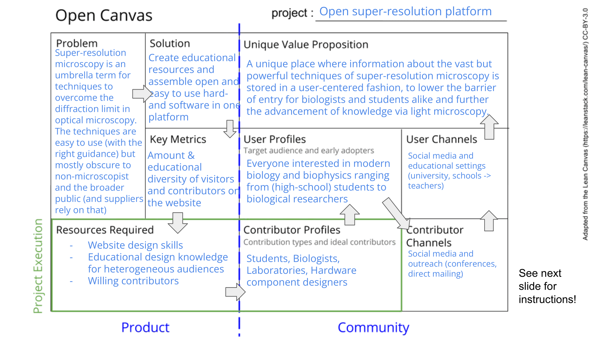

[](https://openscience.org)
[](https://openlifesci.org/)


# Blink 2629
## Building a platform for open and reproducible super-resolution imaging hardware and analytical tools
Project outline of the OpenLifeScience - cohort 6 project "Building a platform for open and reproducible super-resolution imaging hardware and analytical tools" 

We are creating an educational and connecting platform to bridge the gap between (super-resolution) microscopists and the broader public/non-microscopy labs to inspire interest into both optics and biophysics in future generations and make cutting-edge techniques more available to non-microscopy labs with eager contribution of the broader open microscopy community.

## Table of Contents
- [Blink 2629](#blink-2629)
  - [Building a platform for open and reproducible super-resolution imaging hardware and analytical tools](#building-a-platform-for-open-and-reproducible-super-resolution-imaging-hardware-and-analytical-tools)
  - [Table of Contents](#table-of-contents)
- [:bookmark: Background](#bookmark-background)
- [:arrow\_upper\_right: Canvas](#arrow_upper_right-canvas)
- [:world\_map: Roadmap](#world_map-roadmap)
    - [What do we need to do?](#what-do-we-need-to-do)
  - [:one: Milestone 1 - Planning (week 6)](#one-milestone-1---planning-week-6)
  - [:two: Milestone 2 - Prototype Launch (week 10)](#two-milestone-2---prototype-launch-week-10)
  - [:three: Milestone 3 - Evaluation and Publish (week 15)](#three-milestone-3---evaluation-and-publish-week-15)
  - [:grey\_question: Status](#grey_question-status)
  - [:hammer\_and\_wrench: Immediate issues](#hammer_and_wrench-immediate-issues)
- [:neckbeard: Contribution](#neckbeard-contribution)
  - [Prerequisites](#prerequisites)
  - [Installation](#installation)
- [:mortar\_board: Code of conduct](#mortar_board-code-of-conduct)
- [:writing\_hand: Authors](#writing_hand-authors)
- [:notebook\_with\_decorative\_cover: License](#notebook_with_decorative_cover-license)
- [:gift\_heart: Acknowledgments](#gift_heart-acknowledgments)


# :bookmark: Background

Super-resolution microscopy is an umbrella term for techniques to overcome the diffraction limit in optical microscopy. The techniques are easy to use (with the right guidance) but mostly obscure to non-microscopists and the broader public (and suppliers rely on that).  


# :arrow_upper_right: Canvas



# :world_map: Roadmap

Building a platform for open and reproducible super-resolution imaging hardware and analytical tools. The open-super-resolution platform makes high resolution imaging techniques more accessible for non-microscopy experts such as biologist, biophysicts and the general public especially younger students with interets in life sciences.
To build the platform, we will set up an website where various multi-media contents are hosted. The contents include:

- Detailed instuctions for setting up the super-resolution imaging facilities including the hardwares and analytical tools.
- Super-resolution images with meta-data that gives sufficient information to reproduce.
- Educational resources for super-resolution imaging methods.

We also aim at an interactive feature on the platform to encourage microscopy users and developers to share openly and contribute.

### What do we need to do?
- On the one hand, we need to plan, prepare and select materials that will go open; on the other hand, we need to establish the platform to make it user-friendly and interactive.

## :one: Milestone 1 - Planning (week 6)
- [X] Screen for possible platforms to host the website
- [X] Plan sitemap and features of the website
- [X] Learn the web design skills required for the features desired. Seek mentor/expert’s help if needed.

## :two: Milestone 2 - Prototype Launch (week 10)
- [X] Launch of website within our network of collabrators and students
- [ ] Collect feedback and iterative development
- [ ] Test the interactive feature

## :three: Milestone 3 - Evaluation and Publish (week 15)
- [ ] Publish and campaign of the website
- [ ] Analyze the visitor numbers and profiles
- [ ] Establish long-term maintainence scheme of the site

## :grey_question: Status

Protoype launch (week 14). 

## :hammer_and_wrench: Immediate issues
- [ ] Contribution feature
- [ ] Website outline


# :neckbeard: Contribution 

We invite early- and mid-career researchers of various imaging experience to contribute to the project.
This ranges from feedback regarding/creation of educational content to sharing of protocols, schematics and tipps in the setup and usage of various open microscope systems.

[](CODE_OF_CONDUCT.md)

Please read [CONTRIBUTING.md](CONTRIBUTING.md) for details on our code of conduct, and the process for submitting pull requests to us.

## Prerequisites

What things you need to install the software and how to install them.

The website is hosted vie github pages and built locally with [jekyll](https://jekyllrb.com/).  

```sh
Give examples
```

## Installation

A step by step series of examples that tell you how to get the website development env running.

```sh   
Give the example
```

And repeat.

```sh
until finished
```


# :mortar_board: Code of conduct

This project and everyone participating in it is governed by the Code of Conduct (CODE_OF_CONDUCT.md). By participating, you are expected to uphold this code.


# :writing_hand: Authors

- Moritz Engelhardt - Initial work, contributions - [mo_engels](https://github.com/mo_engels)
- Ran Huo - Initial work, contributions - [r-huo](https://github.com/r-huo)

See also the list of contributors (https://github.com/your/project/contributors) who participated in this project.

# :notebook_with_decorative_cover: License

This project is licensed under the Creative Commons copyright licenses - see the LICENSE (LICENSE) file for details.

# :gift_heart: Acknowledgments

- Hat tip to anyone whose code was used
- Inspiration